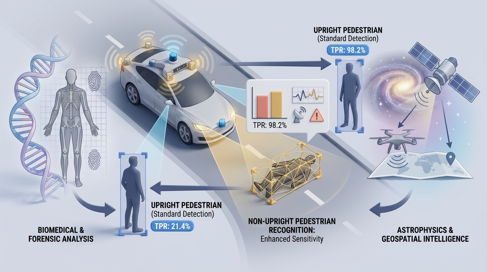

# Dr. Nick Barua | ニック・バルア 🇯🇵 🇬🇧

> **Physicist · Executive · Researcher** | Hyogo, Japan 🇯🇵 · Originally from 🇬🇧
> BSc Physics — Yale University · MSc Astrophysics — Caltech · PhD — University of Hertfordshire

---

## 🔬 Research Focus

My current research addresses a critical and largely unresolved gap in road traffic safety: pedestrians in non-upright postures — individuals already lying on the road due to medical emergency, intoxication, or displacement following a prior collision — carry a forensic fatality rate of **33.0%**, more than double the rate for upright pedestrian collisions, yet standard ADAS systems detect them at only **21.4% TPR** under night conditions.

My programme bridges **Forensic Biomechanics**, **Multi-Modal Sensor Fusion**, and **Functional Safety (ISO 26262)** to move from post-mortem analysis of fatalities to proactive harm prevention in autonomous driving systems.

> *Current research focuses on automotive safety, forensic biomechanics, and AI-based injury prevention; earlier work includes astrophysics and galactic evolution.*

---
## 🌟 Featured Publication

### Battery State-of-Health as a Functional Safety Variable

**Battery State-of-Health as a Functional Safety Variable: an ISO 26262-Aligned AI Framework for Electric Vehicle ADAS Power Integrity**

This work treats battery State-of-Health as a live functional-safety variable rather than only a maintenance indicator. It presents a five-layer framework connecting SoH estimation, power-margin monitoring, safety decision logic, vehicle response, and lifecycle management.

📖 **Published in:** *Scientific Reports*  
🔗 **Article:** https://doi.org/10.1038/s41598-026-65007-4  
👤 **Role:** First Author

---

## 📊 Research Snapshot

| | |
|---|---|
| 🟢 Peer-reviewed articles | 7 |
| 🔄 Under review | 9 |
| 📄 Preprints & working papers | 15+ |
| 🔒 Patent applications | 1 |
| 🔬 Research domains | Automotive Safety · Forensic Biomechanics · Geospatial Intelligence · Astrophysics |

---

## 🔬 Research Fields

- Artificial Intelligence (AI)
- Machine Learning & Deep Learning
- Computer Vision
- Multi-Modal Sensor Fusion
- Autonomous Vehicle Safety
- Traffic Accident Reconstruction
- Injury Biomechanics
- Forensic Medicine
- Public Health & Injury Prevention
- Human-Centered Safety Systems

## 📚 Publications

### Peer-Reviewed Journal Articles

| Title | Area | Journal | Year | Role | Status |
|---|---|---|---|---|---|
| [Battery State-of-Health as a Functional Safety Variable: an ISO 26262-Aligned AI Framework for Electric Vehicle ADAS Power Integrity](https://doi.org/10.1038/s41598-026-65007-4) | EV Battery Safety, ADAS, Functional Safety | *Scientific Reports* | 2026 | **First Author** | ✅ Published |
| [A Multi-Modal AI System for Detecting Pedestrians Lying on the Road: Simulation-Based Safety and Injury Risk Analysis](https://doi.org/10.3390/vehicles8060136) | Autonomous Vehicle Safety, AI | *Vehicles* 8(6), 136 | 2026 | **First Author** | ✅ Published |
| [A Physics-Grounded Multi-Modal Sensor Fusion Framework for Pedestrian Impact Kinematic Reconstruction Under Uncertainty](https://doi.org/10.3390/s26113387) | Sensor Fusion, Biomechanics | *Sensors* 26(11), 3387 | 2026 | **First Author** | ✅ Published |
| [Causes of Severe Injuries in Wheelchair User Motor Vehicle Passengers](https://www.jstage.jst.go.jp/article/ehpm/31/0/31_26-00037/_article/-char/ja/) | Public Health, Injury Prevention | *Environmental Health and Preventive Medicine* 31:36 | 2026 | Co-Author | ✅ Published |
| [Advanced Multi-Modal Sensor Fusion System for Detecting Falling Humans](https://doi.org/10.3390/vehicles7040149) | Computer Vision, Sensor Fusion | *Vehicles* 7(4), 149 | 2025 | **First Author** | ✅ Published |
| [Enhancing Audio Classification Through MFCC Feature Extraction and Data Augmentation with CNN and RNN Models](https://doi.org/10.14569/IJACSA.2024.0150704) | Audio AI, Deep Learning | *IJACSA* 15(7) | 2024 | Co-Author | ✅ Published |
| [Formation and Evolution of Galaxies: Starlight Synthesis Algorithm](https://doi.org/10.4236/ijaa.2022.121005) | Astrophysics, Computational Astronomy | *International Journal of Astronomy and Astrophysics* 12(1), 68–93 | 2022 | **Sole Author** | ✅ Published |

## 🔒 Intellectual Property

| Type | Details | Status |
|---|---|---|
| Japanese Patent Application | 特願2025-167440 — Multi-Modal Sensor Fusion System | Registration in Progress |

---

## 🏛️ Affiliations

### 🏢 Executive

| Role | Organisation |
|---|---|
| Chairman & CEO | [AN Holdings Co.](https://anholdings.co/) |
| Director | [New Space Intelligence Inc. (NSI)](https://newspaceint.com/) |
| Executive Chairman | [Hucha Co., Ltd](https://www.hucha.co.jp/) |

### 🎓 Academic Appointments

| Role | Institution |
|---|---|
| Visiting Professor | Shiga University of Medical Science — Dept. of Legal Medicine |
| Visiting Professor | Kobe Gakuin University — Dept. of Social Studies of Disaster Management |
| Visiting Professor | University of Science and Technology, Chittagong |

### 🏆 Awards & Recognition

| Year | Award | Organisation |
|---|---|---|
| 2026 | [Top 10 Visionary Entrepreneurs Shaping the Future](https://www.msn.com/en-us/money/smallbusiness/top-10-visionary-entrepreneurs-shaping-the-future-in-2026/ar-AA1VxyWp) | CEO Monthly |
| 2025 | [Global CEO Excellence Awards — Winner](https://www.ceo-review.com/hall-of-fame/global-ceo-excellence-awards-2025/) | CEO Monthly |
| 2022 | [Most Innovative Executive / CEO of the Year — Japan](https://apacinsider.digital/winners/nick-barua/) | APAC Insider |

---

## 📚 Publications

### Peer-Reviewed Journal Articles

| Title | Journal | Year | Role | Status |
|---|---|---|---|---|
| [A Multi-Modal AI System for Detecting Pedestrians Lying on the Road: Simulation-Based Safety and Injury Risk Analysis](https://www.mdpi.com/journal/vehicles) | *MDPI Vehicles* | 2026 | **Lead** | ✅ Published |
| [A Physics-Grounded Multi-Modal Sensor Fusion Framework for Pedestrian Impact Kinematic Reconstruction Under Uncertainty](https://doi.org/10.3390/s26113387) | *MDPI Sensors* 26(11), 3387 | 2026 | **Lead** | ✅ Published |
| [Advanced Multi-Modal Sensor Fusion System for Detecting Falling Humans](https://doi.org/10.3390/vehicles7040149) | *MDPI Vehicles* 7(4), 149 | 2025 | **Lead** | ✅ Published |
| [Causes of Severe Injuries in Wheelchair User Motor Vehicle Passengers](https://www.jstage.jst.go.jp/article/ehpm/31/0/31_26-00037/_article/-char/ja/) | *Environmental Health and Preventive Medicine* 31:36 | 2026 | Co-Author | ✅ Published |

View complete publication list

| Title | Journal | Year | Role | Status |
|---|---|---|---|---|
| [Formation and Evolution of Galaxies: Starlight Synthesis Algorithm](https://doi.org/10.4236/ijaa.2022.121005) | *IJAA* 12(1), 68–93 | 2022 | **Solo** | ✅ Published |
| [Enhancing Audio Classification Through MFCC Feature Extraction and Data Augmentation](https://thesai.org/Publications/ViewPaper?Volume=15&Issue=7&Code=ijacsa&SerialNo=4) | *IJACSA* 15(7), 37–53 | 2024 | Co-Author | ✅ Published |

### Manuscripts in Progress

| Title | Target Venue | Status |
|---|---|---|
| Unified Fatality Risk Model (UFRM): Quantifying the Hidden Fatality Risk Gap for Non-Upright Pedestrians | *Accident Analysis & Prevention* | 🔜 Upcoming |

### Selected Working Papers & Preprints

🚗 Automotive Safety & AI — click to expand

- [From Post-Mortem to Prevention: Redefining "Invisible" Pedestrians through ISO 26262 and Multi-Modal AI](https://doi.org/10.2139/ssrn.6305618) — SSRN, 2026
- [Integrated Safety Architectures: Leveraging Multi-Modal AI and ISO 26262 to Protect Vulnerable Road Users](http://dx.doi.org/10.2139/ssrn.6112086) — SSRN, 2026
- [Sudden Incapacitation or Death at the Wheel: Unravelling the Predictors of Catastrophic Multi-Vehicle Collisions](http://dx.doi.org/10.2139/ssrn.6305478) — SSRN, 2026
- [The Invisible Victims of the Road: Why ADAS Cannot See the Pedestrians Most Likely to Die](https://www.preprints.org) — Preprints.org, 2026
- [Mechanisms, Modelling, and Machine Learning-Based Prediction of Lithium-Ion Battery Degradation in EVs](http://dx.doi.org/10.2139/ssrn.5375081) — SSRN, 2025

🛰️ UAV & Geospatial Intelligence — click to expand

- [Latency-Constrained UAV Operations over SATCOM: Stochastic Jitter Modelling, Adaptive Autonomy, and Regulatory Consolidation](https://www.preprints.org) — Preprints.org, 2026
- [Risk-Aware AI Architecture for BVLOS UAV Safety: Integrating Sensor Fusion and SATCOM](https://www.preprints.org) — Preprints.org, 2026
- [The Intelligence Multiplier: Orchestrating the Future of Sovereign GEOINT (2025–2034)](https://www.preprints.org) — Preprints.org, 2026
- [Global Homeland Security Satellite Imagery Market: Strategic Outlook and Growth Trajectories](http://dx.doi.org/10.2139/ssrn.5364419) — SSRN, 2025
- [Bridging the Data-to-Decision Gap: The Role of Specialised Data Pipeline Services in the Global Homeland Security Satellite Imagery Market](http://dx.doi.org/10.2139/ssrn.5375081) — SSRN, 2025
- [SATCOM, The Future UAV Communication Link](https://dx.doi.org/10.2139/ssrn.4059066) — SSRN, 2022

🌌 Astrophysics & Galactic Science — click to expand

- [Chemo-kinematic Tomography of the Milky Way using APOGEE, GALAH, and Gaia DR3](https://ssrn.com) — SSRN, 2026
- [Galactic Archaeology: A Chemo-Kinematic Review of the Milky Way's Hierarchical Assembly](http://dx.doi.org/10.2139/ssrn.5379476) — SSRN, 2025
- [Galactic Paleontology: Reconstructing Accretion Events with Chemo-Dynamical Signatures](http://dx.doi.org/10.2139/ssrn.5427474) — SSRN, 2025
- [Unveiling Galactic Assembly: Chemo-Kinematic Insights from Stellar Absorptions](https://dx.doi.org/10.2139/ssrn.5343246) — SSRN, 2025

### Intellectual Property

| Type | Reference | Status |
|---|---|---|
| 🇯🇵 Patent (Japan) | 特願2025-167440 — Multi-Modal Sensor Fusion System | 🔒 Registration in progress |

---

## 📂 Repositories

### 🚗 Automotive Safety & AFODS

| Repository | Description |
|---|---|
| [From-Post-Mortem-to-Prevention-AFODS](https://github.com/Nick-Barua/From-Post-Mortem-to-Prevention-AFODS) | ISO 26262-aligned AFODS framework — 98.2% TPR for fallen pedestrian detection |
| [AFODS-Sensor-Fusion-Code](https://github.com/Nick-Barua/AFODS-Sensor-Fusion-Code) | YOLOv7 and GRU model scripts supporting the AFODS manuscripts |
| [AFODS-Operational-Sequence](https://github.com/Nick-Barua/AFODS-Operational-Sequence) | Visualisation of the 5-stage AFODS data processing pipeline |
| [Advanced-Multi-Modal-Sensor-Fusion-System-for-Detecting-Falling-Humans](https://github.com/Nick-Barua/Advanced-Multi-Modal-Sensor-Fusion-System-for-Detecting-Falling-Humans) | Original *Vehicles* 2025 paper implementation |

### 🦴 Forensic & Kinematic Reconstruction

| Repository | Description |
|---|---|
| [Forensic-Kinematic-Reconstruction-2026](https://github.com/Nick-Barua/Forensic-Kinematic-Reconstruction-2026) | Phase 1 implementation for *Sensors* 2026 — LiDAR/NIR/IMU fusion |
| [Kinematic-Safety-Framework](https://github.com/Nick-Barua/Kinematic-Safety-Framework) | Cross-domain AI architecture bridging forensic biomechanics and ISO 26262 |

### 📈 Risk Modelling & Systems

| Repository | Description |
|---|---|
| [Unified-Fatality-Risk-Model-UFRM](https://github.com/Nick-Barua/Unified-Fatality-Risk-Model-UFRM) *(private)* | Numerical validation suite for the UFRM |
| [Sudden-Incapacitation-or-Death-at-the-Wheel](https://github.com/Nick-Barua/Sudden-Incapacitation-or-Death-at-the-Wheel) | Analysis of 1,258 incidents predicting catastrophic multi-vehicle collisions |
| [Estimator-Collapse-Theory-ECT-Framework](https://github.com/Nick-Barua/Estimator-Collapse-Theory-ECT-Framework) | ECT v2.1 — formal framework for the "Confidently Wrong" estimator regime |
| [Latency-Constrained-UAV-Operations-over-SATCOM](https://github.com/Nick-Barua/Latency-Constrained-UAV-Operations-over-SATCOM) | Latency-aware modelling and risk analysis for UAV SATCOM operations |

### 🌌 Astrophysics

| Repository | Description |
|---|---|
| [Formation-and-Evolution-of-Galaxies-Starlight-Synthesis-Algorithm](https://github.com/Nick-Barua/Formation-and-Evolution-of-Galaxies-Starlight-Synthesis-Algorithm) | Galactic velocity dispersion & spectral synthesis — *IJAA* 2022 |
| [Unveiling-Galactic-Assembly-Chemo-Kinematic-Insights-from-Stellar-Absorptions](https://github.com/Nick-Barua/Unveiling-Galactic-Assembly-Chemo-Kinematic-Insights-from-Stellar-Absorptions) | Starlight Synthesis Algorithm numerical framework |

---

## 📬 Identifiers & Profiles

| Platform | Link |
|---|---|
| 🟢 ORCID | [0000-0003-4641-0112](https://orcid.org/0000-0003-4641-0112) |
| 🔵 ISNI | [0000 0005 3020 7165](https://isni.org/isni/0000000530207165) |
| 🎓 Google Scholar | [Nick Barua](https://scholar.google.com/citations?user=hbQtWFwAAAAJ) |
| 🔬 ResearchGate | [Nick-Barua](https://www.researchgate.net/profile/Nick-Barua) |
| 🗾 Researchmap Japan | [nickbarua](https://researchmap.jp/nickbarua) |
| 💼 LinkedIn | [nickbarua](https://www.linkedin.com/in/nickbarua) |
| 🏢 AN Holdings | [anholdings.co](https://anholdings.co/) |

---

> *"From forensic reconstruction to proactive prevention — closing the detection gap for the pedestrians most likely to die."*
> — Dr. Nick Barua
